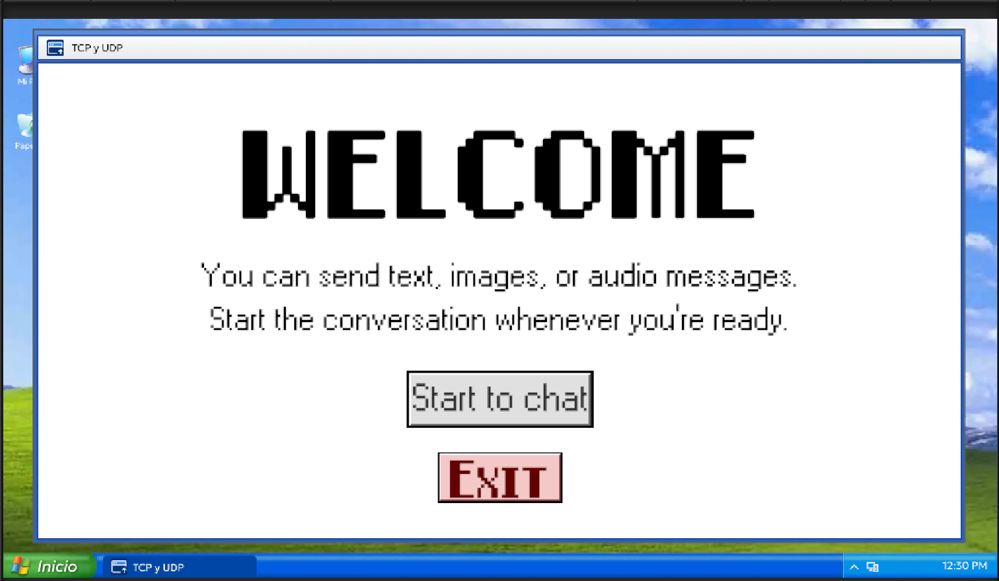
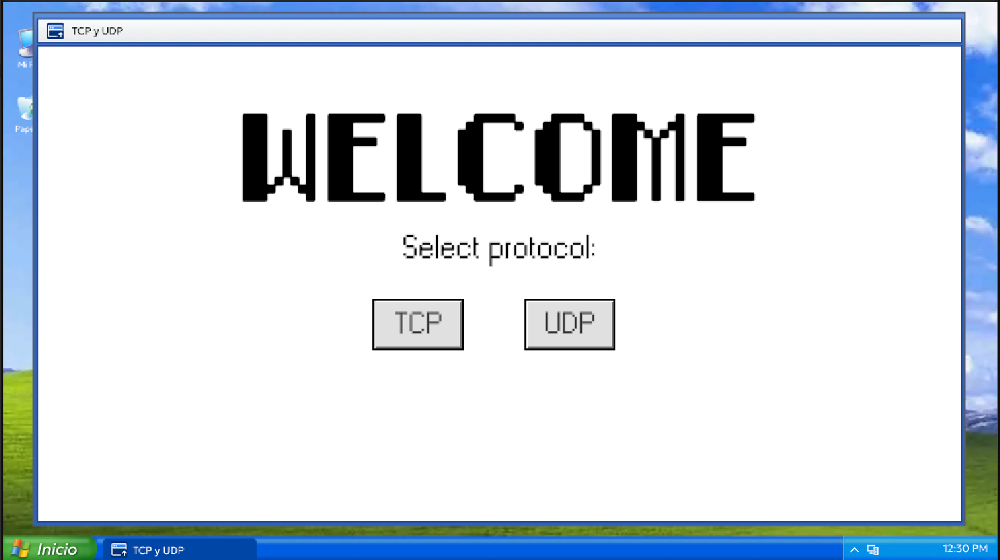
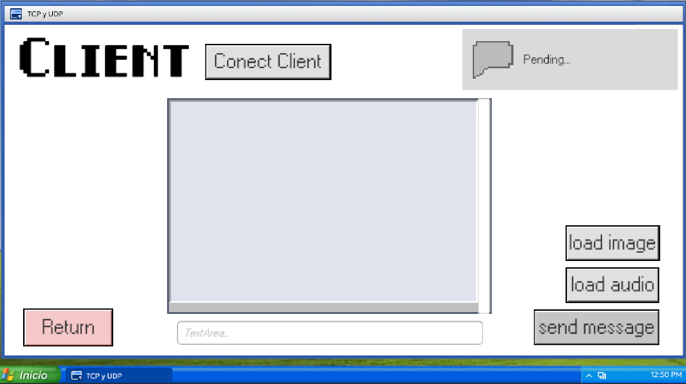
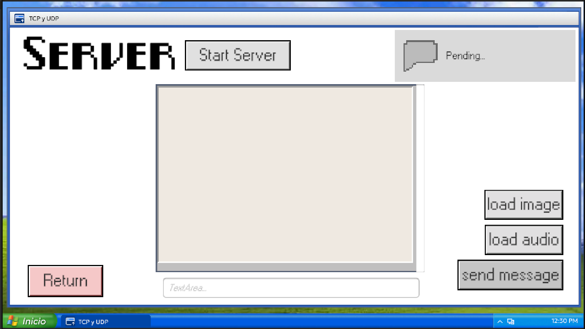

# Documentación - Chat TCP/UDP

## Índice
1. [Descripción general](#descripción-general)
2. [Características principales](#características-principales)
3. [Protocolos de red](#protocolos-de-red)
   - [TCP](#tcp)
   - [UDP](#udp)
   - [Comparación rápida](#comparación-rápida)
4. [Envío de mensajes y archivos](#envío-de-mensajes-y-archivos)
   - [Estructura de los mensajes](#estructura-de-los-mensajes)
   - [Ejemplos de implementación](#ejemplos-de-implementación)
5. [Ejecución y uso](#ejecución-y-uso)
6. [Estructura del proyecto](#estructura-del-proyecto)
7. [Tabla de scripts](#tabla-de-scripts)
8. [Lógica de fragmentación (chunking)](#lógica-de-fragmentación-chunking)
9. [Arquitectura del sistema](#arquitectura-del-sistema)
10. [Interfaz del usuario](#interfaz-del-usuario)

---

## Descripción general
**Chat TCP/UDP** es una aplicación de mensajería desarrollada en **Unity** que permite comunicarse entre un servidor y un cliente usando **TCP** o **UDP** a elección. La idea es comparar el comportamiento de ambos protocolos en el envío de texto, imágenes y audio, y ofrecer una base extensible para proyectos de red.

---

## Características principales
- Soporte para **TCP** y **UDP** seleccionables en tiempo de ejecución
- Envío de mensajes de texto, imágenes (JPEG) y audio
- Fragmentación automática de paquetes grandes (UDP)
- Interfaz con explorador de archivos y panel de chat
- Estructura modular basada en interfaces y capas

---

## Protocolos de red

### TCP
Transmission Control Protocol es orientado a conexión. Antes de enviar datos se realiza un *handshake* de tres vías; el flujo es fiable, ordenado y con control de congestión. En este proyecto:

- Se utiliza `NetworkStream` y se define un encabezado de 8 bytes (`MessageType` + longitud) para delimitar mensajes.
- La función `ReadExactAsync` lee exactamente el número de bytes esperado.

**Ventajas:** no hay pérdida o reordenamiento, la fragmentación es transparente.

### UDP
User Datagram Protocol es sin conexión; los paquetes (datagramas) se envían cada uno de forma independiente y pueden perderse o llegar fuera de orden.

- El sistema implementa `UDPChunkSender`/`Receiver` para dividir y reconstruir mensajes que superan ~1000 bytes.
- El cliente/servidor UDP no mantiene estado entre envíos.

**Ventajas:** menor latencia, útil para grandes volúmenes de datos cuando se tolera pérdida.

### Comparación rápida

| Característica         | TCP                                     | UDP                                      |
|------------------------|-----------------------------------------|------------------------------------------|
| Orientación            | Conexión (handshake)                    | No conexión (datagramas)                |
| Fiabilidad             | Sí (retransmisión, orden)               | No (paquetes pueden perderse/reordenar) |
| Tamaño de datagrama    | Flujo continuo, divide internamente     | Límite ~65 KB; se fragmenta manualmente  |
| Uso en proyecto        | Mensajes cortos & sencillos             | Datos grandes; multimedia                |
| Complejidad            | Sencillo                               | Requiere control de fragmentos          |
| Latencia               | Mayor (control de flujo)                | Menor en redes locales                  |
| Estado                 | Socket persistente                      | Stateless, envíos independientes        |

> **Nota:** El módulo UDP incorpora `UDPChunkSender/Receiver` para permitir el envío de archivos de gran tamaño, algo que TCP maneja internamente.

---

## Envío de mensajes y archivos

### Estructura de los mensajes
Las unidades de intercambio se llaman `NetworkMessage` y contienen un `MessageType` y un `byte[] Data` serializado en UTF‑8 o binario.

```csharp
[Serializable]
public class NetworkMessage {
    public MessageType type;
    public byte[] data;
}

enum MessageType {
    Text, Image, Audio, System
}
```

### Ejemplos de implementación
**Cliente TCP – envío de texto**

```csharp
public async Task SendTextAsync(string text) {
    var msg = new NetworkMessage { 
        type = MessageType.Text,
        data = Encoding.UTF8.GetBytes(text)
    };
    byte[] payload = Serialize(msg);
    await networkStream.WriteAsync(payload, 0, payload.Length);
}
```

**Servidor UDP – fragmentación automática**

```csharp
public void Send(NetworkMessage message, IPEndPoint endpoint) {
    byte[] bytes = Serialize(message);
    if (bytes.Length > CHUNK_SIZE) {
        UDPChunkSender.Send(bytes, endpoint, udpClient);
    } else {
        udpClient.Send(bytes, bytes.Length, endpoint);
    }
}
```

**Recepción (UDPChunkReceiver)**

```csharp
void HandlePacket(byte[] packet) {
    using var ms = new MemoryStream(packet);
    int marker = BinaryReader.ReadInt32();
    if (marker == -1) {
        // fragmentado
        // reconstruir hasta recibir todos los fragmentos
    } else {
        var msg = Deserialize<NetworkMessage>(packet);
        Process(msg);
    }
}
```

Esta lógica permite que el usuario seleccione un archivo desde el explorador de la UI y el sistema convierta su contenido en un `NetworkMessage` con tipo `Image` o `Audio` antes de enviarlo.

---

## Ejecución y uso
1. Abrir el proyecto en Unity (versión indicada en `ProjectSettings/ProjectVersion.txt`).
2. Ejecutar la escena principal (`SampleScene` o similar).
3. En la primera pantalla elegir **Servidor** o **Cliente**.
4. Por defecto la IP es `127.0.0.1` y el puerto `5555`; se pueden modificar en la UI.
5. Seleccionar protocolo desde el menú desplegable o ajustando `ProtocolState.useTCP` en el inspector.
6. Presionar **Conectar** o **Iniciar servidor**.
7. En el campo de texto escribir mensajes o usar los botones para enviar imágenes/audio.
8. Ver las conversaciones en tiempo real. Cerrar la aplicación para desconectar.

> Para pruebas en red local utilice dos instancias del ejecutable; para simular pérdida de paquetes con UDP puede usar `Wireshark` o un emulador de red.

---

## Estructura del proyecto
La carpeta `Assets/Chat_TCP_UDP` contiene todo el código relevante. La organización general es:

```
Chat_TCP_UDP/
├── Audio/                 # sonidos UI
├── Scripts/              # código fuente
│   ├── Interface/         # contratos comunes
│   ├── ProcessMessage/    # definición de mensajes
│   ├── TCP/               # lógica TCP
│   ├── UDP/               # lógica UDP + chunking
│   ├── UI/                # componentes de interfaz
│   ├── Client/
│   ├── Server/
│   └── ObjectsChat/
│  
├── README.md              # índice de los docs
└── recursos estáticos (mp3, imágenes)
```

---

## Tabla de scripts
| Archivo (relativo)                 | Propósito principal                               |
|-----------------------------------|---------------------------------------------------|
| `Interfaces/IClient.cs`           | Interfaz común para clientes (connect/Send/...)    |
| `Interfaces/IServer.cs`           | Interfaz común para servidores                    |
| `Interfaces/IChatConnection.cs`   | Eventos y métodos compartidos                     |
| `ProcessMessage/NetworkMessage.cs`| Modelo de mensaje y enumeración de tipos          |
| `TCP/TCPClient.cs`                | Cliente TCP con stream y serialización            |
| `TCP/TCPServer.cs`                | Servidor TCP                                      |
| `UDP/UDPClient.cs`                | Cliente UDP con fragmentación de mensajes         |
| `UDP/UDPServer.cs`                | Servidor UDP                                      |
| `UDP/UDPChunkSender.cs`           | Divide mensajes grandes en paquetes UDP           |
| `UDP/UDPChunkReceiver.cs`         | Reconstruye mensajes fragmentados                 |
| `UI/Client/UIClient.cs`           | Control de la UI del cliente                      |
| `UI/Server/UIServer.cs`           | Control de la UI del servidor                     |
| `UI/ObjectsChat/*`                | Componentes UI reutilizables (botones, previews)  |

---

## Lógica de fragmentación (chunking)

### UDP
Cuando un mensaje supera `CHUNK_SIZE` (1 000 bytes por defecto), `UDPChunkSender` crea paquetes con un encabezado especial:

```
[marker=-1][messageId][index][total][chunkData]
```

El receptor acumula los fragmentos en un diccionario y, al recibir `total` piezas, concatena los `chunkData` y deserializa el mensaje completo.

### TCP
TCP no necesita fragmentación. Aun así, el proyecto utiliza un encabezado de 8 bytes (`MessageType`+longitud) y la función `ReadExactAsync` para leer el tamaño correcto del siguiente mensaje. Esto simplifica la lógica de procesamiento y evita lecturas parciales en el stream.

---

## Arquitectura del sistema

```
┌─────────────────────────────────────────┐
│        Capa de Interfaz (UI)           │
│   UIServer        │        UIClient    │
└────────┬──────────┴─────────┬──────────┘
         │                    │
┌────────┴────────────────────┴──────────┐
│     Capa de Abstracción (Interfaces)   │
│   IServer          │       IClient     │
└────────┬───────────┴──────────┬────────┘
         │                      │
┌────────┴──────────┬───────────┴────────┐
│  Capa de Protocolo de Red             │
│  TCP                │      UDP        │
│ ┌────────────────────────────────┐   │
│ │ TCPServer     │     UDPServer  │   │
│ │ TCPClient     │     UDPClient  │   │
│ └────────────────────────────────┘   │
└─────────────────┬────────────────────┘
                  │
         ┌────────┴────────┐
         │  NetworkMessage │
         │  ProcessMessage │
         └─────────────────┘
```

Cada capa sólo conoce la anterior; la interfaz UI no manipula sockets directamente. Esto facilita el reemplazo del protocolo o la ampliación de tipos de mensajes.

---

## Interfaz del usuario






La primera pantalla permite seleccionar el rol y el protocolo. Una vez conectados, el chat muestra los mensajes entrantes y ofrece botones para adjuntar archivos.

---
